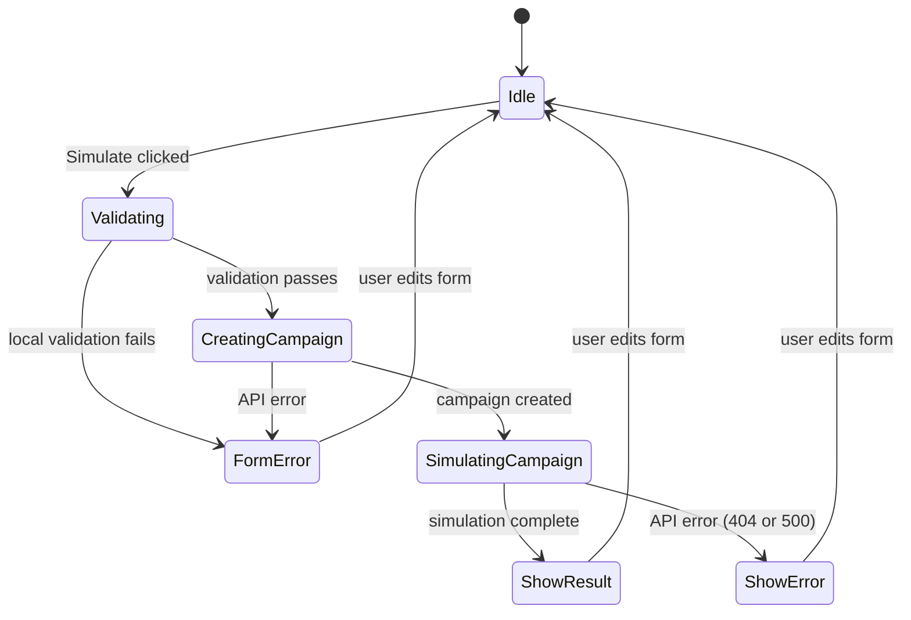

# Architecture

## Overview

The system follows a strict layered architecture: domain → data → services → routes on the backend, and types → api-client → query-client → components → page on the frontend. Each layer depends only on the layer below it; no layer imports from a layer above it. This was chosen over MVC because MVC conflates data access with business logic in the Model, and over feature-based folders because the system has a single domain (campaigns) — feature folders would add indirection with no organizational benefit at this scale.

Frontend and backend communicate over REST. Every response follows a consistent JSON envelope: `{ data: T }` on success, `{ error: string, details?: unknown }` on failure. The Axios instance in `lib/api-client.ts` registers a response interceptor that unwraps the `{ data: T }` envelope before the Promise resolves, so no component or hook ever receives the wrapper — they see the raw payload directly. Error responses are normalized to `ApiError` instances in the same interceptor, making the rest of the frontend immune to raw Axios errors.

The most consequential design decision is the placement of `ICampaignRepository` in `backend/src/domain/types.ts` rather than in the data layer alongside its implementation. The domain layer defines what it needs (a repository contract); the data layer fulfills it (`CampaignRepository implements ICampaignRepository`). This is the Dependency Inversion Principle applied at the module boundary: high-level policy (campaign rules, simulation logic) does not depend on low-level detail (how campaigns are stored). Replacing the in-memory Map with a Prisma client requires writing one new class in `src/data/` and updating the wiring in `campaign-routes.ts` — nothing in `domain/` or `services/` changes.

## Layer Diagram

```mermaid
flowchart TD
  classDef frontend fill:#dbeafe,stroke:#3b82f6,color:#1e3a5f
  classDef backend  fill:#dcfce7,stroke:#22c55e,color:#14532d
  classDef domain   fill:#fef9c3,stroke:#eab308,color:#713f12

  A[Browser]:::frontend
  B[Next.js Page]:::frontend
  C[React Query Hook]:::frontend
  D[Axios Client]:::frontend
  E[Express Router]:::backend
  F[Campaign Service]:::backend
  G[Rule Engine]:::domain
  H[Campaign Repository]:::backend
  I[(In-Memory Map)]:::backend

  A -->|user action| B
  B -->|calls| C
  C -->|HTTP POST| D
  D -->|unwraps envelope| E
  E -->|validates with Zod| F
  F -->|evaluateRule| G
  F -->|findById / save| H
  H -->|reads/writes| I
  G -->|SimulateResult| F
  F -->|Campaign / SimulateResult| E
  E -->|{ data: T }| D
  D -->|resolved Promise| C
  C -->|mutation state| B
```

## Key Design Decisions

**Decision:** In-memory Map over SQLite/Prisma
**Alternative considered:** SQLite with Prisma ORM
**Rationale:** Zero configuration, no migration setup, no Docker dependency. `ICampaignRepository` is defined as an interface in the domain layer, so swapping to Prisma requires only a new data-layer implementation with no changes to services or routes. This is documented as the first item in "If I Had More Time" in the README.

---

**Decision:** `ICampaignRepository` defined in the domain layer, not the data layer
**Alternative considered:** Interface defined alongside its implementation in `/data`
**Rationale:** The domain layer defines what it needs; the data layer fulfills it. This is the Dependency Inversion Principle — high-level policy does not depend on low-level detail. Placing the interface in `/data` would invert the dependency and force the service layer to import from the data layer to get the contract type.

---

**Decision:** Operator set extended to five (`<`, `>`, `=`, `>=`, `<=`) beyond the three specified in the original challenge (`<`, `>`, `=`)
**Alternative considered:** Implement only the three operators from the spec
**Rationale:** `>=` and `<=` are required for meaningful boundary conditions — the CTR >= 10 mock campaign demonstrates this. The original spec likely omitted them for brevity. The rule engine handles them via a `Record<RuleOperator, OperatorFn>` map, so adding two entries adds no structural complexity.

---

**Decision:** Frontend types duplicated from the backend rather than shared via a package
**Alternative considered:** Shared `@campaign/types` npm workspace package
**Rationale:** A shared package adds build tooling, versioning, and cross-project import complexity that is not justified for an MVP. The duplication is intentional and documented with a file-level comment in `frontend/src/types/campaign.ts`. In production a shared package would be the correct approach.

---

**Decision:** `useMutation` (not `useQuery`) for the simulate endpoint
**Alternative considered:** `useQuery` with a dynamic query key triggered by user input
**Rationale:** Simulation is a user-triggered action with side effects (campaign creation precedes it), not a background data fetch. `useMutation` models this correctly: it does not run on mount, does not retry automatically, and exposes `isPending`/`isError` states that map directly to UI feedback without cache invalidation concerns.

---

**Decision:** App Router (`/app`) over Pages Router (`/pages`)
**Alternative considered:** Next.js Pages Router as suggested in the original spec
**Rationale:** App Router is the current Next.js standard as of v13+ and provides a better foundation for Server Components, streaming, and layout nesting. For this MVP the functional difference is minimal, but the upgrade future-proofs the frontend without adding implementation complexity.

## API Contracts

```typescript
// Request — POST /api/campaigns
type CreateCampaignDto = {
  name:         string             // min 3, max 100 chars
  budget:       number             // positive, min 1
  creativities: string[]           // min 1 item — required by spec
  audience:     AudienceCondition[] // min 1 item
  rule:         Rule
}

// Request — POST /api/campaigns/:id/simulate
type SimulateInputDto = {
  metric: string
  value:  number
}

// Response — Campaign entity (returned by POST /api/campaigns)
type Campaign = {
  id:           string
  name:         string
  budget:       number
  creativities: string[]           // always present — required field
  audience:     AudienceCondition[]
  rule:         Rule
  createdAt:    string             // ISO 8601 — Date serialized as string over JSON
}

// Response — Simulate result (returned by POST /api/campaigns/:id/simulate)
type SimulateResult = {
  triggered: boolean
  action:    Action | null
  code:      'TRIGGERED' | 'NOT_TRIGGERED' | 'METRIC_MISMATCH'
  reason:    string
}

// Shared building blocks
type Operator = '<' | '>' | '=' | '>=' | '<='
type Action   = 'pause' | 'scale_up' | 'alert'

type Rule = {
  metric:   string
  operator: Operator
  value:    number
  action:   Action
}

type AudienceCondition = {
  field: 'country' | 'device' | 'age_range'
  value: string
}
```

## Frontend State Flow



## What Changes in Production

| Area           | Current (MVP)              | Production                                                                                                  |
| -------------- | -------------------------- | ----------------------------------------------------------------------------------------------------------- |
| Authentication | None                       | JWT + refresh tokens, protected routes, user-scoped campaigns                                               |
| Persistence    | In-memory Map              | PostgreSQL via Prisma, connection pooling                                                                   |
| Simulation     | Synchronous HTTP call      | Async queue (BullMQ + Redis)                                                                                |
| Logging        | `console.error`            | Structured logs (pino) + tracing (OpenTelemetry)                                                            |
| Error tracking | None                       | Sentry with source maps                                                                                     |
| Testing        | Unit + 1 integration suite | Unit + integration + E2E (Playwright)                                                                       |
| CI/CD          | None                       | GitHub Actions: lint → test → build → deploy                                                                |
| Rate limiting  | None                       | Per-user rate limit on `/simulate` (Redis)                                                                  |
| CORS           | `localhost:3000` hardcoded | Environment-driven allowlist                                                                                |
| Type sharing   | Duplicated FE/BE types     | Shared `@campaign/types` package (npm workspace)                                                            |
| Security       | None                       | HTTPS enforcement, input sanitization, secrets manager (AWS SSM or Vault), dependency scanning (Dependabot) |
